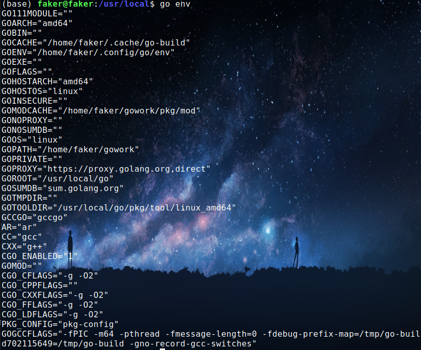
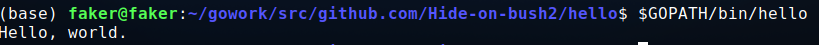
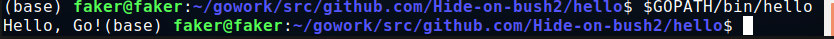
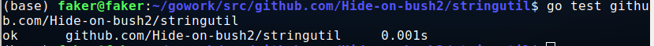
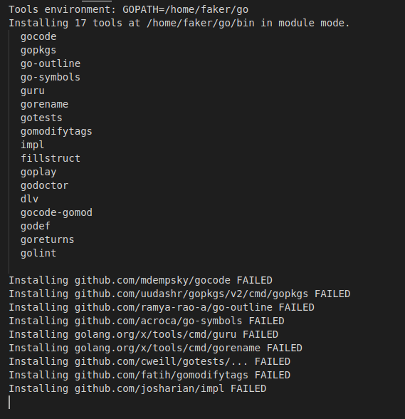
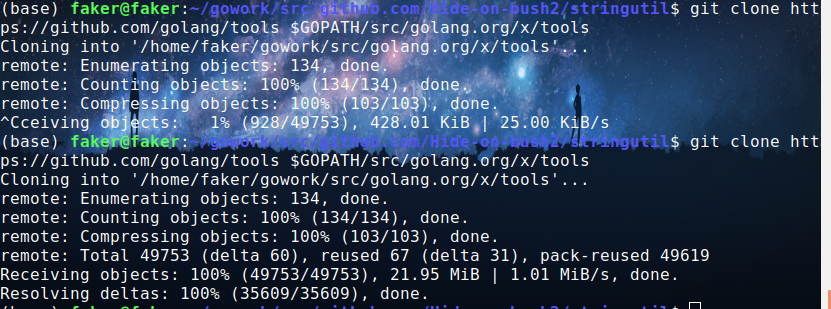
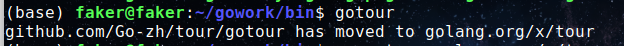
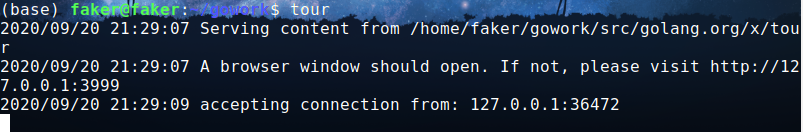
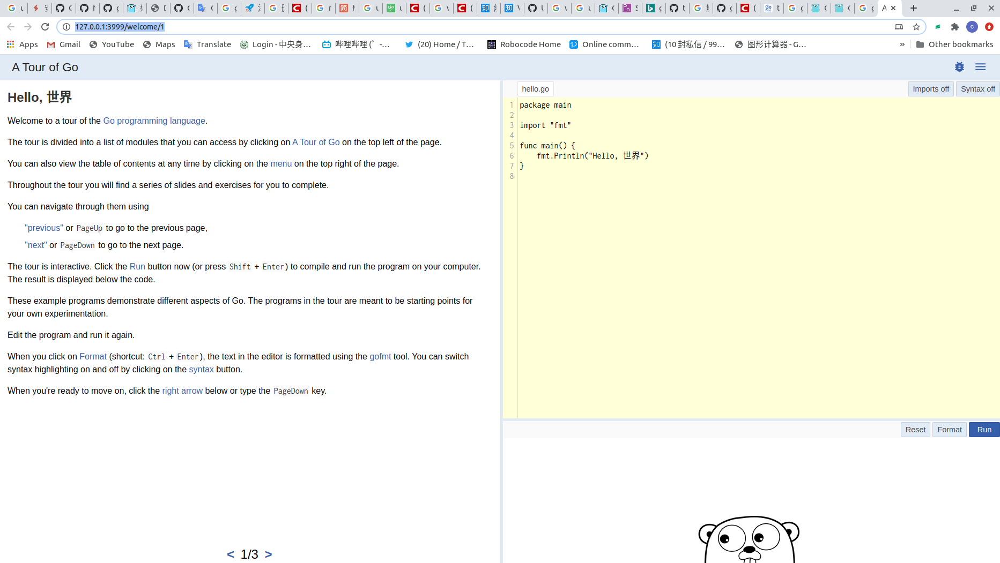

# Homework1

目录：
* [安装golang]("安装golang") 
* [设置环境变量]("设置环境变量")
* [创建Helloworld]("创建Helloworld")
* [创建第一个库]("创建第一个库")
* [第一个测试]("第一个测试")
* [安装与运行go tour]("安装与运行`gotour`")

## 安装golang

ubuntu直接使用`apt-get`来下载，执行以下命令：

```
sudo apt-get install golang
```
但是这样子下载得到的版本并不是最新的，建议直接到[官网](https://golang.org/doc/install?download=go1.15.2.linux-amd64.tar.gz)下载

然后进入安装包的目录下，执行：
```
tar -xzf go1.15.2.linux-amd64.tar.gz
```

然后将其复制到`/usr/local`下：
```
sudo cp -rf go /usr/local
```

然后进入`/usr/local/go`文件夹，给予其`0777`权限：
```
cd /usr/local/
sudo chmod -R 0777 go
```

接下来是修改`~/.bashrc`文件，在后面加上以下几行 ：
```
export PATH=$PATH:/usr/local/go/bin
```
然后执行`go version`，看到以下结论，则说明安装成功：


## 设置环境变量

首先创建工作空间目录：
```
mkdir $HOME/gowork
```

设置该路径为`GOPATH`，在`~/.bashrc`中添加以下代码:
```
export GOPATH=$HOME/gowork
```

并将此工作空间的bin子目录添加到`PATH`中：
```
export PATH=$PATH:$GOPATH/bin
```

然后执行`go env`来检查相关配置：  



## 创建Helloworld

首先创建包路径：
```
mkdir -p $GOPATH/src/github.com/Hide-on-bush2
```

创建第一个程序的目录：
```
mkdir $GOPATH/src/github.com/Hide-on-bush2/hello
```

然后进入相应的目录下，创建一个`hello.go`文件，并编辑该文件如下：
```
package main

import "fmt"

func main() {
	fmt.Printf("Hello, world.\n")
}
```

然后可以用go工具来构建并安装此程序了：
```
go install github.com/Hide-on-bush2/hello
```

然后便可以输入`$GOPATH/bin/hello`来执行：


## 创建第一个库

创建包目录：
```
mkdir $GOPATH/src/github.com/Hide-on-bush2/stringutil
```

然后在该目录中创建文件`reverse.go`，并编辑文件内容如下：
```
// stringutil 包含有用于处理字符串的工具函数。
package stringutil

// Reverse 将其实参字符串以符文为单位左右反转。
func Reverse(s string) string {
	r := []rune(s)
	for i, j := 0, len(r)-1; i < len(r)/2; i, j = i+1, j-1 {
		r[i], r[j] = r[j], r[i]
	}
	return string(r)
}
```

然后可以用`go build`命令来测试编译：
```
go build github.com/Hide-on-bush2/stringutil
```

然后执行`go install`命令，将包的对象放到工作空间的`pkg`目录中：
```
go install github.com/Hide-on-bush2/stringutil
```

然后修改`hello.go`文件来使用`stringutil`包：
```
package main

import (
	"fmt"

	"github.com/Hide-on-bush2/stringutil"
)

func main() {
	fmt.Printf(stringutil.Reverse("!oG ,olleH"))
}
```

然后执行安装：
```
go install github.com/Hide-on-bush2/hello
```

然后执行`$GOPATH/bin/hello`来运行新的`hello`程序：


## 第一个测试

创建测试文件：
```
touch $GOPATH/src/github.com/Hide-on-bush2/stringutil/reverse_test.go
```

编辑`reverse_test.go`文件如下：
```
package stringutil

import "testing"

func TestReverse(t *testing.T) {
	cases := []struct {
		in, want string
	}{
		{"Hello, world", "dlrow ,olleH"},
		{"Hello, 世界", "界世 ,olleH"},
		{"", ""},
	}
	for _, c := range cases {
		got := Reverse(c.in)
		if got != c.want {
			t.Errorf("Reverse(%q) == %q, want %q", c.in, got, c.want)
		}
	}
}
```

然后执行`go test github.com/Hide-on-bush2/stringutil`来运行该测试：


## 安装必要的工具和插件

在`vscode`创建一个`test.go`文件，会提示你安装一些插件，点击`install All`会发生错误 ：


只能手动`clone`:  



然后执行以下命令手动安装：
```
go install golang.org/x/tools/go/buildutil
```

[设置代理](https://learnku.com/go/wikis/38122)，使用国内镜像加速：
```
# 启用 Go Modules 功能
go env -w GO111MODULE=on

# 1. 七牛 CDN
go env -w  GOPROXY=https://goproxy.cn

# 2. 阿里云
go env -w GOPROXY=https://mirrors.aliyun.com/goproxy/

# 3. 官方
go env -w  GOPROXY=https://goproxy.io

```

之后写个脚本`install.sh`来手动安装插件（需要挂VPN）:
```
go get -v github.com/mdempsky/gocode
go get -v github.com/uudashr/gopkgs/v2/cmd/gopkgs
go get -v github.com/ramya-rao-a/go-outline
go get -v github.com/acroca/go-symbols
go get -v golang.org/x/tools/cmd/guru
go get -v golang.org/x/tools/cmd/gorename
go get -v github.com/cweill/gotests/...
go get -v github.com/fatih/gomodifytags
go get -v github.com/josharian/impl
go get -v github.com/davidrjenni/reftools/cmd/fillstruct
go get -v github.com/haya14busa/goplay/cmd/goplay
go get -v github.com/godoctor/godoctor
go get -v github.com/go-delve/delve/cmd/dlv
go get -v github.com/stamblerre/gocode
go get -v github.com/rogpeppe/godef
go get -v github.com/sqs/goreturns
go get -v golang.org/x/lint/golint

```

记得给予它执行权限 ：
```
sudo chmod +x install.sh
```

就可以通过执行`./install.sh`来正常下载了

## 安装与运行`gotour`

如果是按照以下比较旧的版本来安装：
```
$ go get github.com/Go-zh/tour/gotour
$ gotour
```

会得到以下结果：  



说明这个是已经过期了的，应该按照[官网](https://learnku.com/go/wikis/38166)来进行下载

下载安装包：
```
go get golang.org/x/tour
```

这时候我们下载得到的安装包放在`$GOPATH/pkg`文件夹下，我们要把它copy到`$GOPATH/src/golang.org/x/tour`，这是因为程序会去读取`$GOPATH/src/golang.org/x/tour`的内容进行渲染：
```
cp -rf $GOPATH/pkg/mod/golang.org/x/tour@v0.0.0-20200508155540-0608babe047d $GOPATH/src/golang.org/x/tour
```

然后再执行`tour`，命令行就会出现以上内容，并且会跳转到`go tour`的页面：




