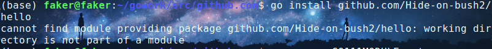
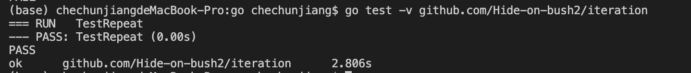
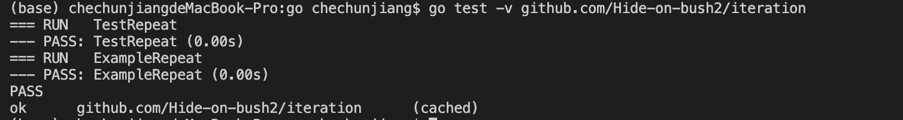
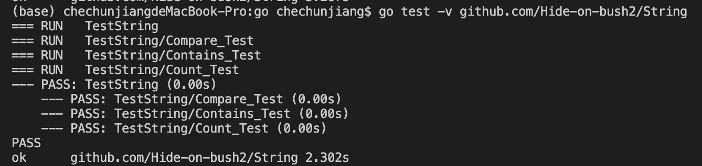
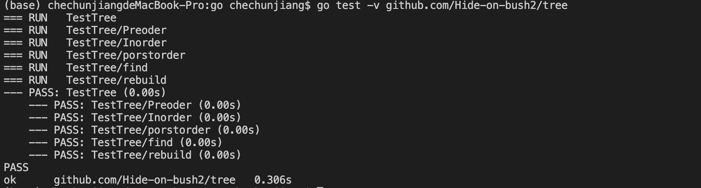

# Homework2

## 参考教程“迭代”章节练习

### 修改测试代码以便调用者可以指定字符重复的次数，然后修复代码

修改测试代码如下：

```
func TestRepeat(t *testing.T) {
	repeated := Repeat("a", 4)
	expected := "aaaa"

	if repeated != expected {
		t.Errorf("expected '%q' but got '%q'", expected, repeated)
	}
}
```

然后运行`go test github.com/Hide-on-bush2/iteration`得到以下编译错误：


编译器告诉我们传入的参数太多，因此我们需要修改`iteration.go`代码：

```
func Repeat(char string, num int) string {
	var repeated string
	for i := 0; i < num; i++ {
		repeated += char
	}
	return repeated
}
```

再次执行`go test github.com/Hide-on-bush2/iteration`：


测试成功

### 写一个`ExampleRepeat`来完善你的函数文档

`ExampleRepeat`代码如下：
```
func ExampleRepeat() {
	s := Repeat("a", 5)
	fmt.Println(s)
	// Output: aaaaa
}
```
注释后面的`Output: aaaaa`代表着期望的输入，再次输入`go test github.com/Hide-on-bush2/iteration`:


可以看到`ExampleRepeat`进行了测试并测试成功

### 看一下`strings`包。找到你认为可能有用的函数，并对它们编写一些测试。投入时间学习标准库会慢慢得到回报

对`Compare`, `Comtain`和`Count`三个函数进行测试，首先编写测试函数如下：

```
func TestString(t *testing.T) {
	t.Run("Compare Test", func(t *testing.T) {
		expected := -1
		got := strings.Compare("aaa", "bbb")
		if got != expected {
			t.Errorf("expected '%d' but got '%d'", expected, got)
		}
	})

	t.Run("Contains Test", func(t *testing.T) {
		expected := true
		got := strings.Contains("SKT-Faker", "Faker")
		if got != expected {
			t.Errorf("expected '%t' but got '%t'", expected, got)
		}
	})

	t.Run("Count Test", func(t *testing.T) {
		expected := 5
		got := strings.Count("aaaaa", "a")
		if got != expected {
			t.Errorf("expected '%d' but got '%d'", expected, got)
		}
	})
}
```

然后执行`go test github.com/Hide-on-bush2/String`执行测试：


可以看到三个函数都经过了测试

## Go语言查找二叉树(BST)实现TDD实践

这部分是用go语言实现查找二叉树，包括插入、删除、查找、遍历等功能

首先编写测试文件`tree_test.go`：
```
package tree

import (
	"testing"
)

func TestTree(t *testing.T) {
	tree := Make_node(4)
	tree = Insert(2, tree)
	tree = Insert(1, tree)
	tree = Insert(3, tree)
	tree = Insert(7, tree)
	tree = Insert(5, tree)
	tree = Insert(8, tree)

	t.Run("Preoder", func(t *testing.T) {
		expected := "4213758"

		got := Preorder(tree)
		if got != expected {
			t.Errorf("expected '%q' but got '%q'", expected, got)
		}
	})

	t.Run("Inorder", func(t *testing.T) {
		expected := "1234578"

		got := Inorder(tree)
		if got != expected {
			t.Errorf("expected '%q' but got '%q'", expected, got)
		}
	})

	t.Run("porstorder", func(t *testing.T) {
		expected := "1325874"

		got := Postorder(tree)
		if got != expected {
			t.Errorf("expected '%q' but got '%q'", expected, got)
		}
	})

	t.Run("find", func(t *testing.T) {
		got := Find(9, tree)

		if got != nil {
			t.Errorf("expected nil but got real pointer")
		}
	})

	t.Run("rebuild", func(t *testing.T) {
		expected := "4213759"

		tree = Delete(8, tree)
		tree = Insert(9, tree)
		got := Preorder(tree)
		if got != expected {
			t.Errorf("expected '%q' but got '%q'", expected, got)
		}

		expected = "421395"
		tree = Delete(7, tree)
		got = Preorder(tree)
		if got != expected {
			t.Errorf("expected '%q' but got '%q'", expected, got)
		}

		expected = "4213956"
		tree = Insert(6, tree)
		got = Preorder(tree)
		if got != expected {
			t.Errorf("expected '%q' but got '%q'", expected, got)
		}
	})
}
```
首先将4、2、1、3、7、5、8依次插入建立一颗二叉树，然后进行前序遍历、中序遍历、后续遍历、查找和重构等测试，其中重构测试将对树节点的插入和删除统一进行测试

然后编写`tree.go`文件

### 插入函数

首先是插入函数，因为树的构建是依次插入节点来完成的：
```
func Insert(num int, tree *node) *node {
	if tree == nil {
		return Make_node(num)
	}
	if tree.val > num {
		tree.left = Insert(num, tree.left)
	} else if tree.val < num {
		tree.right = Insert(num, tree.right)
	}
	return tree

}
```

插入函数将一个节点插入一棵树中，当所要插入的树为空树时，建立一棵只有根节点的树，否则递归进行插入，直至将节点插入为空的子树中

### 删除函数

接下来是删除函数，因为插入和删除是重构一棵树的最简单方法，实现代码如下：

```
func Delete(num int, tree *node) *node {
	if tree == nil {
		fmt.Printf("can not delete node from a empty tree\n")
		return nil
	}
	if num < tree.val {
		tree.left = Delete(num, tree.left)
	} else if num > tree.val {
		tree.right = Delete(num, tree.right)
	} else {
		if tree.left != nil && tree.right != nil {
			tmp := FindMin(tree.right)
			tree.val = tmp.val
			tree.right = Delete(tmp.val, tree.right)
		} else {
			if tree.left == nil {
				tree = tree.right
			} else {
				tree = tree.left
			}
		}
	}
	return tree

}
```

与插入函数一样，删除函数将一个已经在树中的节点从树中删除：
* 如果当前的树为空，说明节点不在传入的树中，返回空指针并输出报错信息
* 如果要删除的节点的值小于当前遍历到的节点的值，递归从当前节点的左子树中删除
* 如果要删除的节点的值大于当前遍历到的节点的值，递归从当前节点的右子树中删除
* 如果遍历到了需要删除的节点，则需要考虑它的子树的数量：
  * 没有左右子树：将当前节点设置为`nil`就可，go会自动释放内存空间，不需要手动`free`
  * 只有一个子树：将当前节点设置为那个子树
  * 有两个子树，将当前节点的值设置为当前节点的右子树中最小的值，并递归在右子树中删除那个节点，因为它最多只有一个子树，可以不需递归便可删除
* 返回删除后的树

### 查找函数

根据BST的构建规则进行查找，代码实习如下：
```
func Find(num int, tree *node) *node {
	if tree == nil {
		return nil
	}

	if tree.val == num {
		return tree
	} else if tree.val < num {
		return Find(num, tree.right)
	} else {
		return Find(num, tree.left)
	}
}
```

* 如果当前树节点为`nil`，说明没找到，返回`nil`
* 如果当前节点为所要查找的值，则当前节点便是要查找的节点，返回该节点
* 如果当前节点的值小于所要查找的值，则递归地从右子树中查找
* 如果当前节点的值大于所要查找的值，则递归地从左子树中查找

### 遍历函数

遍历函数包括前序遍历、中序遍历和后序遍历，实现代码如下：
```
func Preorder(tree *node) string {
	if tree == nil {
		return ""
	}

	return strconv.Itoa(tree.val) + Preorder(tree.left) + Preorder(tree.right)
}

func Inorder(tree *node) string {
	if tree == nil {
		return ""
	}

	return Inorder(tree.left) + strconv.Itoa(tree.val) + Inorder(tree.right)
}

func Postorder(tree *node) string {
	if tree == nil {
		return ""
	}

	return Postorder(tree.left) + Postorder(tree.right) + strconv.Itoa(tree.val)
}
```

* 前序遍历：首先遍历当前节点，然后递归遍历左子树和右子树
* 中序遍历：首先递归遍历左子树，然后遍历当前节点，最后递归遍历右子树
* 后序遍历：首先递归遍历左子树，然后递归遍历右子树，最后遍历当前节点

### 执行测试

执行`go test -v github.com/Hide-on-bush2/tree`，得到以下结果：


可以看见全部通过了测试