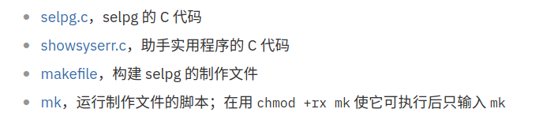
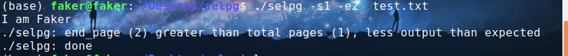
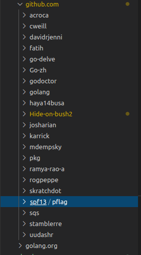
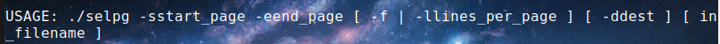
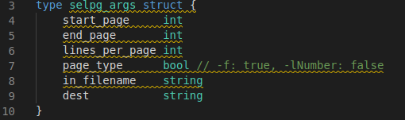

# HW3-使用golang开发Linux命令行实用程序selpg

## 源码运行

在[官网](https://www.ibm.com/developerworks/cn/linux/shell/clutil/index.html)上找到源代码并下载到selpg文件夹中:

然后按照提示赋予`mk`执行的权限，执行`./mk`生成`selpg`可执行文件，然后建立一个`test.txt`测试文件，在里面随便写点什么东西，然后执行：

可以看到执行效果

## 实验准备

安装`pflag`包：
执行`go get github.com/spf13/pflag`，可以看到在`src/github.com`文件夹里面已经有`spf13/pflag`包了：

## 程序开发

### 参数命令管理

定义一个结构体来管理命令行参数，执行源代码时会提示：

因此参数包括：
* 开始页码start_page
* 结束页码end_page
* 自定义页长lines_per_page或者遇换行符换页f
* 输出地址dest
* 文件名in_filename

则定义的结构体如下：

其中`page_type`为true时表示输入的参数为`-f`，为false表示输入的参数为`-lNumber`的形式

### 从输入流中获取输入参数

使用以下函数来从输入流中获取输入的参数
* `IntVarP`
* `StringVarP`
* `BoolVarP`
* `Parse`
* `Args`
